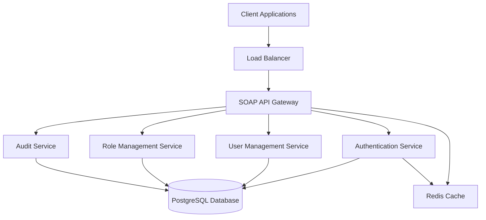
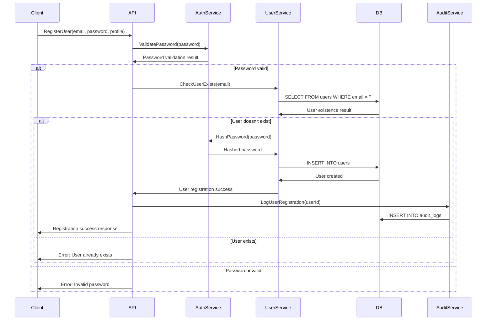
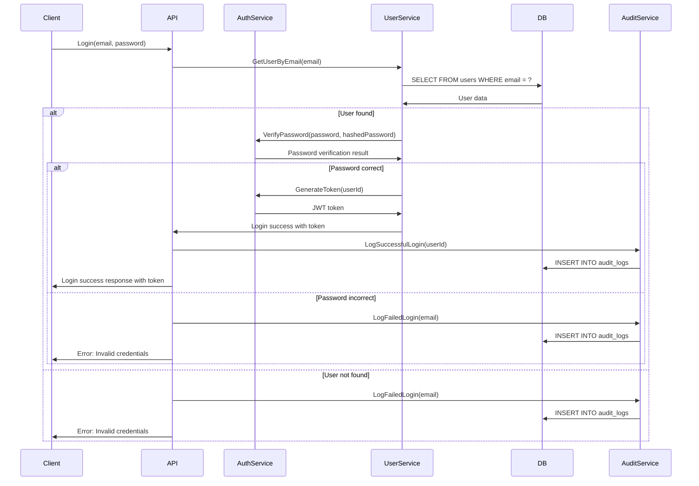
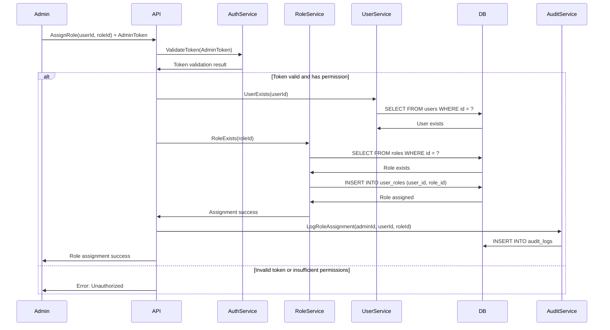
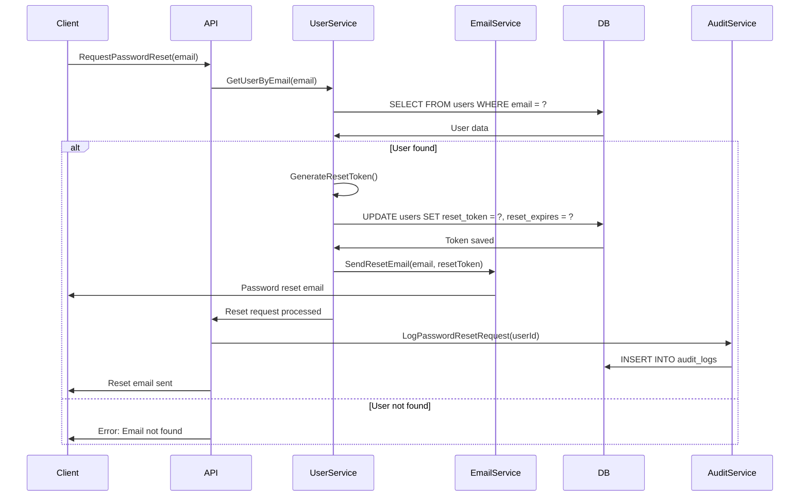
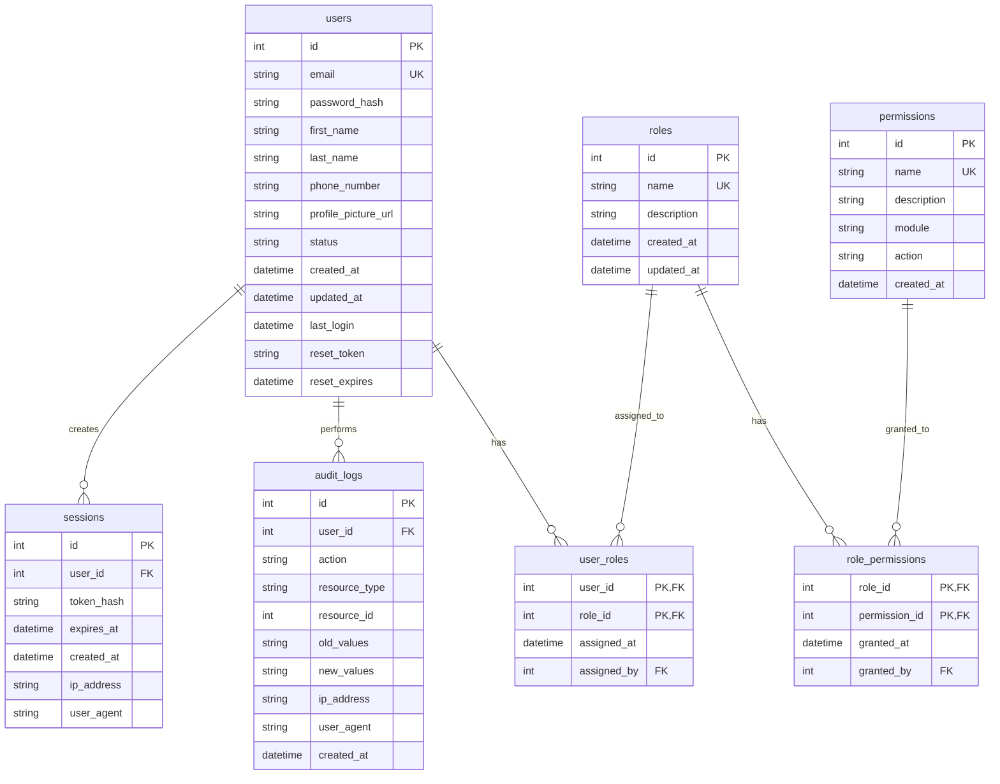

# SOAP API Design for Enhanced User Management System

## Table of Contents
1. [Project Overview](#project-overview)
2. [User Requirements](#user-requirements)
3. [System Architecture](#system-architecture)
4. [Service Flows](#service-flows)
5. [SOAP API Endpoints](#soap-api-endpoints)
6. [Database Schema Design](#database-schema-design)
7. [Security Considerations](#security-considerations)
8. [Error Handling](#error-handling)
9. [Testing Strategy for Robot Framework](#testing-strategy-for-robot-framework)

---

## Project Overview

### Purpose
This document outlines the design of a comprehensive SOAP API service for an enhanced user management system. The system is specifically designed to provide a robust testing environment for Robot Framework automation training.

### Scope
The system includes:
- User authentication and authorization
- User profile management
- Role-based access control (RBAC)
- Comprehensive audit logging
- Permission management
- Password management with reset functionality

### Technology Stack
- **Backend**: Python with SOAP libraries (zeep/spyne)
- **Database**: PostgreSQL
- **Testing**: Robot Framework
- **Documentation**: WSDL for SOAP service definition

---

## User Requirements

### Functional Requirements

#### FR1: User Authentication
- **FR1.1**: Users must be able to register with email and password
- **FR1.2**: Users must be able to login with credentials
- **FR1.3**: System must validate user credentials
- **FR1.4**: System must provide session management
- **FR1.5**: Users must be able to logout

#### FR2: User Profile Management
- **FR2.1**: Users must be able to view their profile information
- **FR2.2**: Users must be able to update their profile information
- **FR2.3**: Users must be able to upload profile pictures
- **FR2.4**: Admin users must be able to view all user profiles
- **FR2.5**: Admin users must be able to deactivate/activate user accounts

#### FR3: Role-Based Access Control
- **FR3.1**: System must support multiple user roles (Admin, Manager, User)
- **FR3.2**: Each role must have specific permissions
- **FR3.3**: Admin users must be able to assign roles to users
- **FR3.4**: System must validate permissions for each operation
- **FR3.5**: Users must be able to view their assigned roles and permissions

#### FR4: Permission Management
- **FR4.1**: System must support granular permissions
- **FR4.2**: Permissions must be categorized by module (User, Profile, Role, Audit)
- **FR4.3**: Admin users must be able to create, update, and delete permissions
- **FR4.4**: Admin users must be able to assign permissions to roles
- **FR4.5**: System must support permission inheritance

#### FR5: Password Management
- **FR5.1**: Users must be able to reset their passwords
- **FR5.2**: System must send password reset emails
- **FR5.3**: Password reset links must expire after specified time
- **FR5.4**: System must enforce password complexity rules
- **FR5.5**: Users must be able to change their passwords

#### FR6: Audit Logging
- **FR6.1**: System must log all user authentication attempts
- **FR6.2**: System must log all profile changes
- **FR6.3**: System must log all role and permission changes
- **FR6.4**: Admin users must be able to view audit logs
- **FR6.5**: Audit logs must include timestamp, user, action, and details

### Non-Functional Requirements

#### NFR1: Security
- **NFR1.1**: All passwords must be hashed using bcrypt
- **NFR1.2**: All sensitive data must be encrypted in transit
- **NFR1.3**: System must implement rate limiting for authentication
- **NFR1.4**: System must protect against common web vulnerabilities

#### NFR2: Performance
- **NFR2.1**: API response time must be under 2 seconds
- **NFR2.2**: System must support 100 concurrent users
- **NFR2.3**: Database queries must be optimized

#### NFR3: Reliability
- **NFR3.1**: System must have 99.9% uptime
- **NFR3.2**: System must implement proper error handling
- **NFR3.3**: System must maintain data integrity

#### NFR4: Usability
- **NFR4.1**: API must follow SOAP standards
- **NFR4.2**: Error messages must be clear and actionable
- **NFR4.3**: API documentation must be comprehensive

---

## System Architecture

### High-Level Architecture



### Service Components

#### 1. SOAP API Gateway
- Entry point for all client requests
- Request routing and validation
- WSDL document generation
- SOAP envelope processing

#### 2. Authentication Service
- User login/logout
- Token generation and validation
- Password hashing and verification
- Session management

#### 3. User Management Service
- User registration and profile management
- User CRUD operations
- Profile picture handling
- User status management

#### 4. Role Management Service
- Role CRUD operations
- Permission assignment
- Role-based authorization
- Permission validation

#### 5. Audit Service
- Audit log generation
- Log retrieval and filtering
- Audit report generation
- Compliance monitoring

---

## Service Flows

### 1. User Registration Flow



### 2. User Authentication Flow



### 3. Role Assignment Flow



### 4. Password Reset Flow



---

## SOAP API Endpoints

### WSDL Structure
```xml
<wsdl:definitions xmlns:wsdl="http://schemas.xmlsoap.org/wsdl/"
                  xmlns:soap="http://schemas.xmlsoap.org/wsdl/soap/"
                  xmlns:tns="http://example.com/usermanagement"
                  xmlns:xsd="http://www.w3.org/2001/XMLSchema"
                  targetNamespace="http://example.com/usermanagement">
    
    <!-- Types section with complex types -->
    <!-- Messages section -->
    <!-- Port types -->
    <!-- Binding -->
    <!-- Service -->
</wsdl:definitions>
```

### Authentication Endpoints

#### 1. RegisterUser
```xml
<wsdl:operation name="RegisterUser">
    <wsdl:input message="tns:RegisterUserRequest"/>
    <wsdl:output message="tns:RegisterUserResponse"/>
</wsdl:operation>

<!-- Request -->
<xsd:complexType name="RegisterUserRequest">
    <xsd:sequence>
        <xsd:element name="email" type="xsd:string"/>
        <xsd:element name="password" type="xsd:string"/>
        <xsd:element name="firstName" type="xsd:string"/>
        <xsd:element name="lastName" type="xsd:string"/>
        <xsd:element name="phoneNumber" type="xsd:string" minOccurs="0"/>
    </xsd:sequence>
</xsd:complexType>

<!-- Response -->
<xsd:complexType name="RegisterUserResponse">
    <xsd:sequence>
        <xsd:element name="userId" type="xsd:int"/>
        <xsd:element name="email" type="xsd:string"/>
        <xsd:element name="message" type="xsd:string"/>
        <xsd:element name="success" type="xsd:boolean"/>
    </xsd:sequence>
</xsd:complexType>
```

#### 2. AuthenticateUser
```xml
<wsdl:operation name="AuthenticateUser">
    <wsdl:input message="tns:AuthenticateUserRequest"/>
    <wsdl:output message="tns:AuthenticateUserResponse"/>
</wsdl:operation>

<!-- Request -->
<xsd:complexType name="AuthenticateUserRequest">
    <xsd:sequence>
        <xsd:element name="email" type="xsd:string"/>
        <xsd:element name="password" type="xsd:string"/>
    </xsd:sequence>
</xsd:complexType>

<!-- Response -->
<xsd:complexType name="AuthenticateUserResponse">
    <xsd:sequence>
        <xsd:element name="token" type="xsd:string"/>
        <xsd:element name="userId" type="xsd:int"/>
        <xsd:element name="roles" type="tns:ArrayOfString"/>
        <xsd:element name="expiresIn" type="xsd:int"/>
        <xsd:element name="success" type="xsd:boolean"/>
    </xsd:sequence>
</xsd:complexType>
```

#### 3. LogoutUser
```xml
<wsdl:operation name="LogoutUser">
    <wsdl:input message="tns:LogoutUserRequest"/>
    <wsdl:output message="tns:LogoutUserResponse"/>
</wsdl:operation>
```

### User Management Endpoints

#### 4. GetUserProfile
```xml
<wsdl:operation name="GetUserProfile">
    <wsdl:input message="tns:GetUserProfileRequest"/>
    <wsdl:output message="tns:GetUserProfileResponse"/>
</wsdl:operation>

<!-- Response -->
<xsd:complexType name="GetUserProfileResponse">
    <xsd:sequence>
        <xsd:element name="userId" type="xsd:int"/>
        <xsd:element name="email" type="xsd:string"/>
        <xsd:element name="firstName" type="xsd:string"/>
        <xsd:element name="lastName" type="xsd:string"/>
        <xsd:element name="phoneNumber" type="xsd:string"/>
        <xsd:element name="profilePicture" type="xsd:string" minOccurs="0"/>
        <xsd:element name="status" type="xsd:string"/>
        <xsd:element name="createdAt" type="xsd:dateTime"/>
        <xsd:element name="updatedAt" type="xsd:dateTime"/>
    </xsd:sequence>
</xsd:complexType>
```

#### 5. UpdateUserProfile
```xml
<wsdl:operation name="UpdateUserProfile">
    <wsdl:input message="tns:UpdateUserProfileRequest"/>
    <wsdl:output message="tns:UpdateUserProfileResponse"/>
</wsdl:operation>
```

#### 6. GetAllUsers
```xml
<wsdl:operation name="GetAllUsers">
    <wsdl:input message="tns:GetAllUsersRequest"/>
    <wsdl:output message="tns:GetAllUsersResponse"/>
</wsdl:operation>
```

#### 7. DeactivateUser
```xml
<wsdl:operation name="DeactivateUser">
    <wsdl:input message="tns:DeactivateUserRequest"/>
    <wsdl:output message="tns:DeactivateUserResponse"/>
</wsdl:operation>
```

### Role Management Endpoints

#### 8. CreateRole
```xml
<wsdl:operation name="CreateRole">
    <wsdl:input message="tns:CreateRoleRequest"/>
    <wsdl:output message="tns:CreateRoleResponse"/>
</wsdl:operation>
```

#### 9. AssignRole
```xml
<wsdl:operation name="AssignRole">
    <wsdl:input message="tns:AssignRoleRequest"/>
    <wsdl:output message="tns:AssignRoleResponse"/>
</wsdl:operation>
```

#### 10. GetUserRoles
```xml
<wsdl:operation name="GetUserRoles">
    <wsdl:input message="tns:GetUserRolesRequest"/>
    <wsdl:output message="tns:GetUserRolesResponse"/>
</wsdl:operation>
```

### Permission Management Endpoints

#### 11. CreatePermission
```xml
<wsdl:operation name="CreatePermission">
    <wsdl:input message="tns:CreatePermissionRequest"/>
    <wsdl:output message="tns:CreatePermissionResponse"/>
</wsdl:operation>
```

#### 12. AssignPermissionToRole
```xml
<wsdl:operation name="AssignPermissionToRole">
    <wsdl:input message="tns:AssignPermissionToRoleRequest"/>
    <wsdl:output message="tns:AssignPermissionToRoleResponse"/>
</wsdl:operation>
```

### Password Management Endpoints

#### 13. RequestPasswordReset
```xml
<wsdl:operation name="RequestPasswordReset">
    <wsdl:input message="tns:RequestPasswordResetRequest"/>
    <wsdl:output message="tns:RequestPasswordResetResponse"/>
</wsdl:operation>
```

#### 14. ResetPassword
```xml
<wsdl:operation name="ResetPassword">
    <wsdl:input message="tns:ResetPasswordRequest"/>
    <wsdl:output message="tns:ResetPasswordResponse"/>
</wsdl:operation>
```

#### 15. ChangePassword
```xml
<wsdl:operation name="ChangePassword">
    <wsdl:input message="tns:ChangePasswordRequest"/>
    <wsdl:output message="tns:ChangePasswordResponse"/>
</wsdl:operation>
```

### Audit Endpoints

#### 16. GetAuditLogs
```xml
<wsdl:operation name="GetAuditLogs">
    <wsdl:input message="tns:GetAuditLogsRequest"/>
    <wsdl:output message="tns:GetAuditLogsResponse"/>
</wsdl:operation>
```

#### 17. GetUserAuditLogs
```xml
<wsdl:operation name="GetUserAuditLogs">
    <wsdl:input message="tns:GetUserAuditLogsRequest"/>
    <wsdl:output message="tns:GetUserAuditLogsResponse"/>
</wsdl:operation>
```

---

## Database Schema Design

### Entity Relationship Diagram



### Table Definitions

#### 1. users table
```sql
CREATE TABLE users (
    id SERIAL PRIMARY KEY,
    email VARCHAR(255) UNIQUE NOT NULL,
    password_hash VARCHAR(255) NOT NULL,
    first_name VARCHAR(100) NOT NULL,
    last_name VARCHAR(100) NOT NULL,
    phone_number VARCHAR(20),
    profile_picture_url VARCHAR(500),
    status VARCHAR(20) DEFAULT 'ACTIVE' CHECK (status IN ('ACTIVE', 'INACTIVE', 'SUSPENDED')),
    created_at TIMESTAMP DEFAULT CURRENT_TIMESTAMP,
    updated_at TIMESTAMP DEFAULT CURRENT_TIMESTAMP,
    last_login TIMESTAMP,
    reset_token VARCHAR(255),
    reset_expires TIMESTAMP
);

CREATE INDEX idx_users_email ON users(email);
CREATE INDEX idx_users_status ON users(status);
```

#### 2. roles table
```sql
CREATE TABLE roles (
    id SERIAL PRIMARY KEY,
    name VARCHAR(50) UNIQUE NOT NULL,
    description TEXT,
    created_at TIMESTAMP DEFAULT CURRENT_TIMESTAMP,
    updated_at TIMESTAMP DEFAULT CURRENT_TIMESTAMP
);

CREATE INDEX idx_roles_name ON roles(name);
```

#### 3. permissions table
```sql
CREATE TABLE permissions (
    id SERIAL PRIMARY KEY,
    name VARCHAR(100) UNIQUE NOT NULL,
    description TEXT,
    module VARCHAR(50) NOT NULL,
    action VARCHAR(50) NOT NULL,
    created_at TIMESTAMP DEFAULT CURRENT_TIMESTAMP
);

CREATE INDEX idx_permissions_module ON permissions(module);
CREATE INDEX idx_permissions_name ON permissions(name);
```

#### 4. user_roles table
```sql
CREATE TABLE user_roles (
    user_id INTEGER REFERENCES users(id) ON DELETE CASCADE,
    role_id INTEGER REFERENCES roles(id) ON DELETE CASCADE,
    assigned_at TIMESTAMP DEFAULT CURRENT_TIMESTAMP,
    assigned_by INTEGER REFERENCES users(id),
    PRIMARY KEY (user_id, role_id)
);

CREATE INDEX idx_user_roles_user_id ON user_roles(user_id);
CREATE INDEX idx_user_roles_role_id ON user_roles(role_id);
```

#### 5. role_permissions table
```sql
CREATE TABLE role_permissions (
    role_id INTEGER REFERENCES roles(id) ON DELETE CASCADE,
    permission_id INTEGER REFERENCES permissions(id) ON DELETE CASCADE,
    granted_at TIMESTAMP DEFAULT CURRENT_TIMESTAMP,
    granted_by INTEGER REFERENCES users(id),
    PRIMARY KEY (role_id, permission_id)
);

CREATE INDEX idx_role_permissions_role_id ON role_permissions(role_id);
CREATE INDEX idx_role_permissions_permission_id ON role_permissions(permission_id);
```

#### 6. audit_logs table
```sql
CREATE TABLE audit_logs (
    id SERIAL PRIMARY KEY,
    user_id INTEGER REFERENCES users(id) ON DELETE SET NULL,
    action VARCHAR(100) NOT NULL,
    resource_type VARCHAR(50) NOT NULL,
    resource_id INTEGER,
    old_values TEXT,
    new_values TEXT,
    ip_address INET,
    user_agent TEXT,
    created_at TIMESTAMP DEFAULT CURRENT_TIMESTAMP
);

CREATE INDEX idx_audit_logs_user_id ON audit_logs(user_id);
CREATE INDEX idx_audit_logs_action ON audit_logs(action);
CREATE INDEX idx_audit_logs_resource_type ON audit_logs(resource_type);
CREATE INDEX idx_audit_logs_created_at ON audit_logs(created_at);
```

#### 7. sessions table
```sql
CREATE TABLE sessions (
    id SERIAL PRIMARY KEY,
    user_id INTEGER REFERENCES users(id) ON DELETE CASCADE,
    token_hash VARCHAR(255) NOT NULL,
    expires_at TIMESTAMP NOT NULL,
    created_at TIMESTAMP DEFAULT CURRENT_TIMESTAMP,
    ip_address INET,
    user_agent TEXT
);

CREATE INDEX idx_sessions_user_id ON sessions(user_id);
CREATE INDEX idx_sessions_token_hash ON sessions(token_hash);
CREATE INDEX idx_sessions_expires_at ON sessions(expires_at);
```

### Initial Data

#### Default Roles
```sql
INSERT INTO roles (name, description) VALUES
('ADMIN', 'System administrator with full access'),
('MANAGER', 'Manager with limited administrative access'),
('USER', 'Regular user with basic access');
```

#### Default Permissions
```sql
INSERT INTO permissions (name, description, module, action) VALUES
-- User permissions
('USER_CREATE', 'Create new users', 'USER', 'CREATE'),
('USER_READ', 'View user information', 'USER', 'READ'),
('USER_UPDATE', 'Update user information', 'USER', 'UPDATE'),
('USER_DELETE', 'Delete users', 'USER', 'DELETE'),
('USER_LIST', 'List all users', 'USER', 'LIST'),

-- Profile permissions
('PROFILE_READ_OWN', 'View own profile', 'PROFILE', 'READ_OWN'),
('PROFILE_UPDATE_OWN', 'Update own profile', 'PROFILE', 'UPDATE_OWN'),
('PROFILE_READ_ALL', 'View any user profile', 'PROFILE', 'READ_ALL'),
('PROFILE_UPDATE_ALL', 'Update any user profile', 'PROFILE', 'UPDATE_ALL'),

-- Role permissions
('ROLE_CREATE', 'Create new roles', 'ROLE', 'CREATE'),
('ROLE_READ', 'View role information', 'ROLE', 'READ'),
('ROLE_UPDATE', 'Update role information', 'ROLE', 'UPDATE'),
('ROLE_DELETE', 'Delete roles', 'ROLE', 'DELETE'),
('ROLE_ASSIGN', 'Assign roles to users', 'ROLE', 'ASSIGN'),

-- Permission permissions
('PERMISSION_CREATE', 'Create new permissions', 'PERMISSION', 'CREATE'),
('PERMISSION_READ', 'View permission information', 'PERMISSION', 'READ'),
('PERMISSION_UPDATE', 'Update permission information', 'PERMISSION', 'UPDATE'),
('PERMISSION_DELETE', 'Delete permissions', 'PERMISSION', 'DELETE'),
('PERMISSION_ASSIGN', 'Assign permissions to roles', 'PERMISSION', 'ASSIGN'),

-- Audit permissions
('AUDIT_READ', 'View audit logs', 'AUDIT', 'READ'),
('AUDIT_EXPORT', 'Export audit logs', 'AUDIT', 'EXPORT');
```

#### Role-Permission Assignments
```sql
-- Admin gets all permissions
INSERT INTO role_permissions (role_id, permission_id)
SELECT r.id, p.id FROM roles r, permissions p WHERE r.name = 'ADMIN';

-- Manager gets limited permissions
INSERT INTO role_permissions (role_id, permission_id)
SELECT r.id, p.id FROM roles r, permissions p 
WHERE r.name = 'MANAGER' AND p.module IN ('USER', 'PROFILE', 'AUDIT');

-- User gets basic permissions
INSERT INTO role_permissions (role_id, permission_id)
SELECT r.id, p.id FROM roles r, permissions p 
WHERE r.name = 'USER' AND p.name IN ('PROFILE_READ_OWN', 'PROFILE_UPDATE_OWN');
```

---

## Security Considerations

### Authentication Security
1. **Password Policy**
   - Minimum 8 characters
   - At least one uppercase letter
   - At least one lowercase letter
   - At least one number
   - At least one special character

2. **Password Storage**
   - Use bcrypt with salt rounds >= 12
   - Never store plain text passwords
   - Implement password history (prevent reuse of last 5 passwords)

3. **Session Management**
   - JWT tokens with expiration
   - Secure token storage
   - Session invalidation on logout
   - Refresh token mechanism

### Authorization Security
1. **Role-Based Access Control**
   - Principle of least privilege
   - Regular permission audits
   - Role hierarchy validation

2. **API Security**
   - Input validation and sanitization
   - SQL injection prevention
   - XML/XXE attack prevention
   - Rate limiting per user/IP

### Data Protection
1. **Encryption**
   - TLS 1.3 for all communications
   - Sensitive data encryption at rest
   - API key and secret management

2. **Audit Trail**
   - Comprehensive logging
   - Immutable audit records
   - Regular log analysis

---

## Error Handling

### Standard Error Response Format
```xml
<soap:Envelope xmlns:soap="http://schemas.xmlsoap.org/soap/envelope/">
    <soap:Body>
        <soap:Fault>
            <faultcode>soap:Client</faultcode>
            <faultstring>Invalid input parameters</faultstring>
            <detail>
                <error xmlns="http://example.com/usermanagement">
                    <code>INVALID_INPUT</code>
                    <message>Email address is required</message>
                    <field>email</field>
                    <timestamp>2024-01-01T12:00:00Z</timestamp>
                </error>
            </detail>
        </soap:Fault>
    </soap:Body>
</soap:Envelope>
```

### Error Codes
- **AUTH_001**: Invalid credentials
- **AUTH_002**: Token expired
- **AUTH_003**: Insufficient permissions
- **USER_001**: User not found
- **USER_002**: User already exists
- **USER_003**: Invalid user status
- **ROLE_001**: Role not found
- **ROLE_002**: Role already assigned
- **PERM_001**: Permission not found
- **PERM_002**: Invalid permission assignment
- **VALID_001**: Invalid input format
- **VALID_002**: Required field missing
- **SYS_001**: Internal server error
- **SYS_002**: Database connection error

---

## Testing Strategy for Robot Framework

### Test Categories

#### 1. Functional Tests
- User registration and login
- Profile management operations
- Role assignment and permission validation
- Password reset functionality
- Audit log verification

#### 2. Security Tests
- Authentication bypass attempts
- Authorization validation
- Input validation testing
- SQL injection prevention
- XML/XXE attack prevention

#### 3. Performance Tests
- Load testing with concurrent users
- Response time validation
- Database query optimization
- Memory usage monitoring

#### 4. Integration Tests
- End-to-end workflow testing
- Database transaction integrity
- External service integration
- Error propagation testing

### Robot Framework Test Structure

#### Test Suite Organization
```
tests/
├── authentication/
│   ├── login_tests.robot
│   ├── registration_tests.robot
│   └── password_reset_tests.robot
├── user_management/
│   ├── profile_tests.robot
│   ├── user_crud_tests.robot
│   └── user_status_tests.robot
├── role_management/
│   ├── role_crud_tests.robot
│   ├── role_assignment_tests.robot
│   └── permission_tests.robot
├── audit/
│   ├── audit_log_tests.robot
│   └── audit_report_tests.robot
├── security/
│   ├── auth_bypass_tests.robot
│   ├── input_validation_tests.robot
│   └── permission_tests.robot
└── performance/
    ├── load_tests.robot
    └── stress_tests.robot
```

#### Sample Test Case
```robotframework
*** Settings ***
Library    RequestsLibrary
Library    XML
Library    Collections
Resource   ../resources/soap_keywords.robot
Resource   ../resources/test_data.robot

*** Variables ***
${SOAP_ENDPOINT}    http://localhost:8000/soap
${WSDL_URL}         http://localhost:8000/wsdl

*** Test Cases ***
Valid User Registration Should Succeed
    [Documentation]    Test that a valid user registration succeeds
    [Tags]    registration    positive
    
    ${user_data}=    Create Dictionary
    ...    email=test@example.com
    ...    password=SecurePass123!
    ...    firstName=Test
    ...    lastName=User
    
    ${response}=    Call SOAP Method
    ...    RegisterUser
    ...    ${user_data}
    
    Should Be Equal As Strings    ${response['success']}    true
    Should Contain    ${response['email']}    test@example.com
    Should Be True    ${response['userId']} > 0

Duplicate User Registration Should Fail
    [Documentation]    Test that duplicate user registration fails
    [Tags]    registration    negative
    
    ${user_data}=    Create Dictionary
    ...    email=existing@example.com
    ...    password=SecurePass123!
    ...    firstName=Existing
    ...    lastName=User
    
    ${response}=    Call SOAP Method
    ...    RegisterUser
    ...    ${user_data}
    
    Should Be Equal As Strings    ${response['success']}    false
    Should Contain    ${response['message']}    already exists
```

### Test Data Management

#### Test Data Categories
1. **Valid Test Data**: Correct inputs for positive testing
2. **Invalid Test Data**: Incorrect inputs for negative testing
3. **Edge Case Data**: Boundary values and special cases
4. **Security Test Data**: Malicious inputs for security testing

#### Data Cleanup Strategy
- Transaction rollback for each test
- Database state reset between test suites
- Isolated test environments
- Automated cleanup scripts

---

## Conclusion

This comprehensive SOAP API design provides a robust foundation for Robot Framework training. The system includes:

1. **Complete User Management**: Authentication, authorization, and profile management
2. **Role-Based Access Control**: Flexible permission system with audit capabilities
3. **Security Best Practices**: Modern security measures and protection mechanisms
4. **Comprehensive Testing**: Extensive test coverage for all system components
5. **Scalable Architecture**: Designed for growth and maintenance

The design follows industry standards and provides excellent learning opportunities for:
- SOAP API development and testing
- Database design and management
- Security implementation and testing
- Test automation with Robot Framework
- System integration and deployment

This system will serve as an excellent training platform for developers and testers working with SOAP APIs and Robot Framework automation.